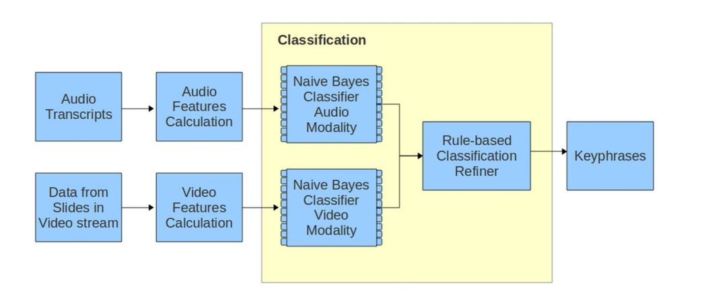
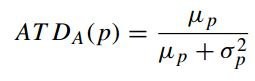
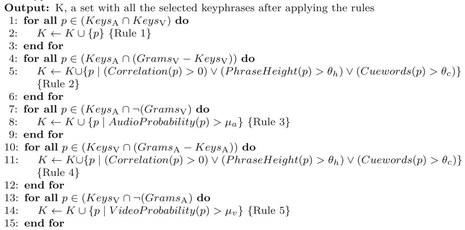
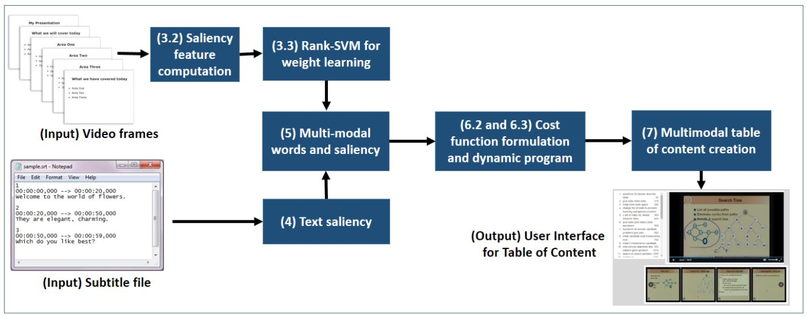

# 实现论文1 ：[A multimodal approach for extracting content descriptive metadata from lecture videos](https://www.researchgate.net/profile/Vidhya_Balasubramanian/publication/274311880_A_multimodal_approach_for_extracting_content_descriptive_metadata_from_lecture_videos/links/561ce64608aea80367266454/A-multimodal-approach-for-extracting-content-descriptive-metadata-from-lecture-videos.pdf)

## 论文摘要：

这篇论文主要包括一个Multimodal Metadata Extraction System 和一个Video Lecture Database System。这里实现了Multimodal Metadata Extraction System。Multimodal Metadata Extraction System的框架如下图所示，分别从语音和幻灯片上提取n-gram，然后两个独立的贝叶斯分类器将n-gram分类为关键词和非关键词，再根据规则来合并。

### step 1.文本预处理
*   关键词抽取的第一步是文本预处理，也就是分别在从语音和幻灯片上获取的文本进行stemming、过滤stopword、POS词性标注、抽取N-gram。

### step 2.提取N-gram的语音特征
*   特征一：Adaptive Term Dispersion(ATD)，帮助识别那些在语音上分布平均的keyphrase。
*   特征二：Localspan，帮助识别那些与子话题关联的keyphrase，这些keyphrase一般聚集在某些特定的段落。
*   特征三：C-Value，计算一个phrase与一个document的关联性。
*   特征四：TF-IDF，计算phrase的频率
*   特征五：Cuewords，帮助识别那些跟在‘called as’, ‘defined’之类的词后面的keyphrase

### step 3.提取N-gram的幻灯片特征
*   特征一：Mean occurrence ratio，计算每个phrase在整个视频中的平均出现次数（总次数/幻灯片数量）
*   特征二：Contiguous Occurrence Ratio，计算每个phrase的最大连续出现次数除以幻灯片数量，再乘一个系数。
*   特征三：Phrase Height，计算每个phrase高度除以最小phrase高度

### step 4.特征值离散化、抽取keyphrase
*   由于抽取的很多特征值是连续的实数，贝叶斯分类器不好训练，所以要先将特征值离散到几个区间范围，这篇文章使用了Entropy-MDL方法进行离散化处理。然后分别把两个模态得到的特征值训练两个独立的朴素贝叶斯分类器，用这两个分类器可分别得到语音和幻灯片的keyphrase

### step 5.多模态抽取的关键词的合并
*   从两个模态抽取的关键词按以下规则合并：

### step 6.基于关键词的分段
*   这里的分段使用了一个改进版的TextTiling算法：
*   1) 先把语音文本分成块，每块N个句子；
*   2) 比较所有相邻块，并计算相似值（基于关键词的BOW向量的余弦相似值）；
*   3) 将所有相似值画成二维走势图，非常相似处会出现波峰，很不相似的地方出现波谷。选择波谷处作为分界线，把块组成段，这些段很可能是有关同一个Subtopic的。

 
 
 
 
 

# 实现论文2 ：[MMToC A Multimodal Method for Table of Content Creation in Educational Videos](http://www.researchgate.net/publication/304417832_MMToC_A_Multimodal_Method_for_Table_of_Content_Creation_in_Educational_Videos)

## 论文摘要：
*   这篇文章与上一篇不同之处在于这篇文章是抽取目录，上一篇论文是抽取关键词。论文的整体框架如下图所示

### step 1
*   文本预处理步骤与上一篇论文差不多

### step 2
*   从幻灯片上得到每个词（visually salient keywords）的不同特征值，然后用rank-SVM根据训练样本得到的权重来将不同特征值加权平均成一个值，这样幻灯片上的每个词就有一个visual saliency score。

### step 3
*   在字幕文件上得到单词（spoken salient keywords）后，先用tf-idf过滤低频词，再用text-rank给每一个词打分，这样字幕上的每个词也有一个spoken saliency score。

### step 4
*   基于visually salient keywords，找到与其余弦距离最近的5个spoken salient keywords（同义词），它们的新score就是它们scores的平均值。所有的visually salient keywords与其同义词用于接下来的分段。

### step 5
*   分段后，所有visually salient keywords的visual score加上其spoken score（如果有的话），然后每段留下5个得分最高的词。然后拿这5个关键词回到字幕文件里进行分析，用窗口大小为3的sliding window扫描文本，与5个关键词co-occurrence最多的三个phrase选为这一段的目录。

 
 
 
 
 

# Libraries used:

*   ["Stanford CoreNLP"](https://nlp.stanford.edu/software/)
*   ["mdlp-discretization"](https://github.com/navicto/Discretization-MDLPC)
*   ["pysrt"](https://github.com/byroot/pysrt)
*   ["nltk"](https://github.com/nltk/nltk)
*   ["sklearn"](https://www.baidu.com/link?url=jwc9RTQO2oPgvGY7YDPDKrrZHs3o7oxo_eezrWG78VECamw_wCCTKkttpQuFI55A&wd=&eqid=cef2d2f2000063d70000000659256a78)
*   matplotlib

